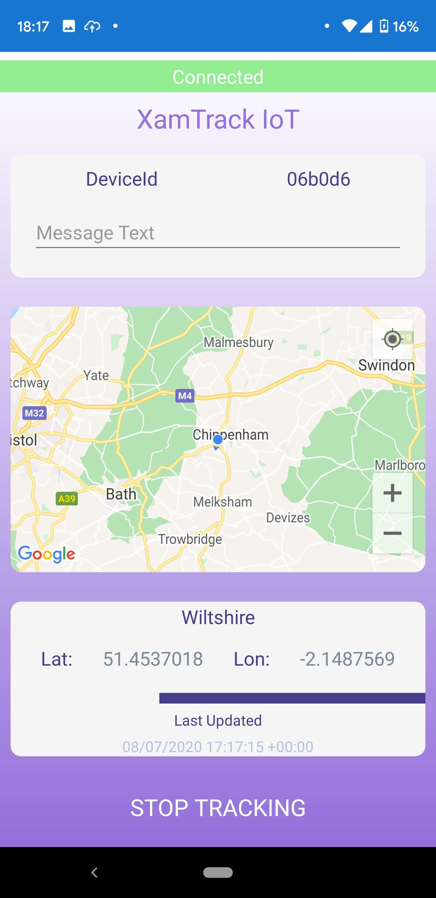
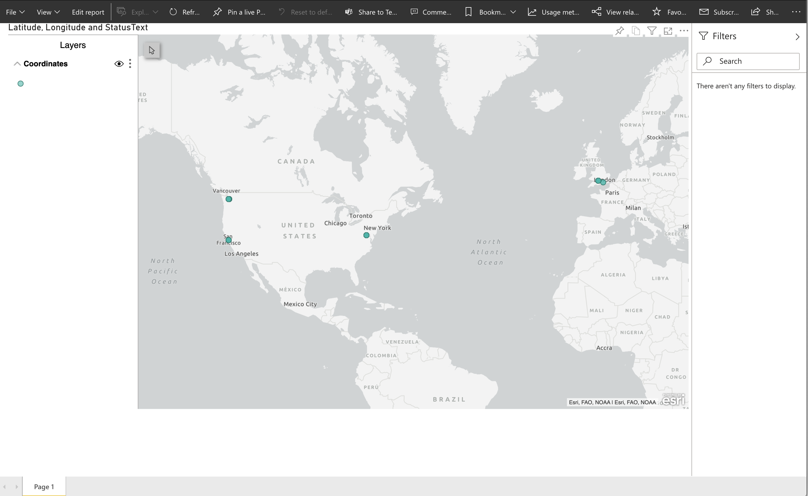

# XamTrack

This repo is the sample code presented as part of the Reactor Twitch Stream on the Microsoft Developer Twitch. This is sample app to demonstrate location tracking using a mobile client (Android and iOS) built using [Xamarin](https://dotnet.microsoft.com/apps/xamarin), [Azure IoT Hub](https://azure.microsoft.com/en-us/services/iot-hub/) and [PowerBi Dashboard](https://docs.microsoft.com/en-us/power-bi/create-reports/service-dashboards).

## Coming soon

If you have come here from the Twitch Stream, come back to find the link for the direct link to the video here! 

Bookmark, Subscribe the [Reactor YouTube channel](https://www.youtube.com/channel/UCkm6luGCS3hD25jcEhvRMIA) to get the notification for this video and other amazing content!​

## Xamarin Client App

XamTrack is a sample single view [Xamarin](https://docs.microsoft.com/en-us/xamarin) app demonstrating the use of [Azure IoT Hub](https://azure.microsoft.com/en-us/services/iot-hub/) and Auto Provisioning via [Azure IoT Hub Device Provisioning Service](https://docs.microsoft.com/en-us/azure/iot-dps/). 

The sample mobile app (illustrated above) is built using [Xamarin.Forms](https://docs.microsoft.com/en-us/xamarin/xamarin-forms/) and leverages [Xamarin Essentials](https://docs.microsoft.com/en-us/xamarin/essentials/) feature [Geolocation](https://docs.microsoft.com/en-us/xamarin/essentials/geolocation?context=xamarin/xamarin-forms).

## Solution Overview
The solution consists of the following projects:  

**XamTrack.Core:**  
Project contains the main service logic, and can be used to drive any UI, like a console app or here, a Xamarin Client app

**XamTrack:**  
The XamTrack Forms project which contains the XAML and shared code  

**XamTrack.Android:**  
The XamTrack Android specific project contains Android assets

**XamTrack.iOS:**  
The XamTrack iOS specific project contains iOS assets  

**XamTrack.UnitTests:**  
The Unit Test project

## Key Concepts

### MVVM
The app uses the [MVVM (Model-View-ViewModel)](https://docs.microsoft.com/en-us/xamarin/xamarin-forms/enterprise-application-patterns/mvvm) pattern to decouple business logic & presentation code. In this sample, we are using [TinyMVVM](https://github.com/TinyStuff/TinyMvvm).

### Unit Tests
Unit tests are run using [NUnit](https://docs.microsoft.com/en-us/dotnet/core/testing/unit-testing-with-nunit). App service functionality is mocked using [Moq](https://github.com/moq/moq4) which highlights a benefit of using a Service Container.

### Continuous Integration
CI is being done via GitHub Actions. It has a basic build and run action setup for this repo. You can look at the workflow in the [Action Tab](https://github.com/xamcat/XamTrack/actions) and to see the code you can look [here](https://github.com/xamcat/XamTrack/blob/main/.github/workflows/build.yml).

## Running the Xamarin App 
You must perform the following prerequisite actions in order to run this sample app:  

1. [Create IoT Hub](https://docs.microsoft.com/en-us/azure/iot-dps/quick-setup-auto-provision#create-an-iot-hub)
2. [Create a new IoT Hub Device Provisioning Service](https://docs.microsoft.com/en-us/azure/iot-dps/quick-setup-auto-provision#create-a-new-iot-hub-device-provisioning-service)
3. [Link the IoT hub and your Device Provisioning Service](https://docs.microsoft.com/en-us/azure/iot-dps/quick-setup-auto-provision#link-the-iot-hub-and-your-device-provisioning-service)
4. [Xamarin.Forms Map Initialization and Configuration](https://docs.microsoft.com/en-us/xamarin/xamarin-forms/user-interface/map/setup)

The following app secrets are defined in the **[appconfig.json](https://github.com/xamcat/XamTrack/blob/main/XamTrack.Core/appconfig.json)** class and need to be replaced with the values generated in the steps above.

1. DpsIdScope
2. IotHubConnectionString
3. DpsSymetricKey
4. DpsSymetricKey

Be sure to configure the Native iOS and Android settings for Maps to work and the azure variables before deploying the app to avoid runtime errors. 

## Setting up Power Bi Dashboard

Try [Power Bi for free](https://powerbi.microsoft.com/en-us/) and create an account.

Follow the steps in this [tutorial](https://docs.microsoft.com/en-us/azure/iot-hub/iot-hub-live-data-visualization-in-power-bi#add-a-consumer-group-to-your-iot-hub). Add a ArcGIS Map and follow this documentation [here](https://doc.arcgis.com/en/maps-for-powerbi/get-started/about-maps-for-power-bi.htm).

## Additional Resources

* [MS Learn Xamarin](https://dotnet.microsoft.com/learn/xamarin)
* [Xamarin.Forms Map Control](https://docs.microsoft.com/en-us/xamarin/xamarin-forms/user-interface/map/)
* [Xamarin.Forms Behavior](https://docs.microsoft.com/en-us/xamarin/xamarin-forms/app-fundamentals/behaviors/)